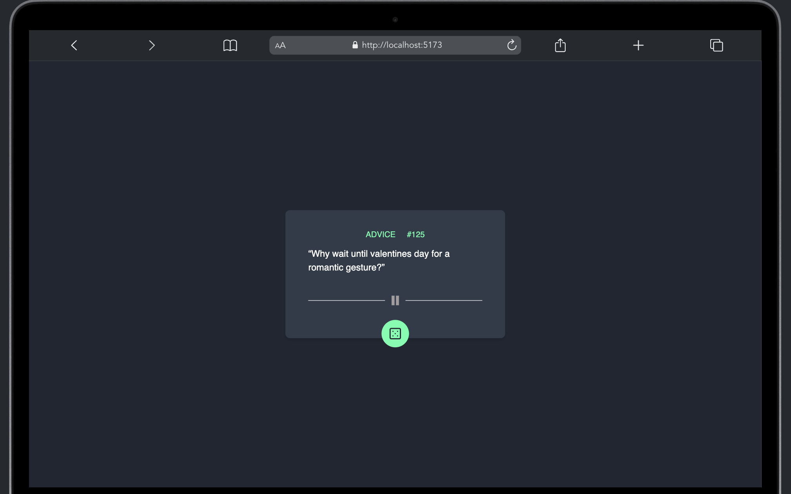

# ADVICE GENERATOR APP

A simple app that generates random advice from the [Advice Slip JSON API](https://api.adviceslip.com/).

## Getting Started

- Clone this repo and cd into it

```bash
git clone
cd advice_generator_app
```

- Install dependencies

```bash
yarn
```

- Start the app

```bash
yarn dev
```

## Screenshots

- Desktop view
  

- Mobile view

  
